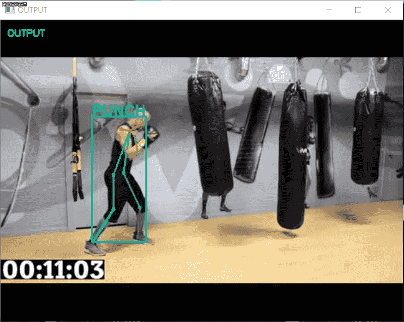
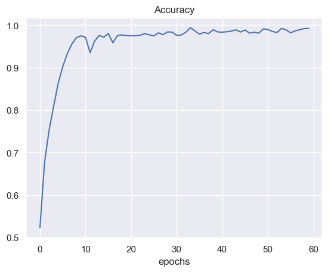

## Human Action Recognition
<p style="text-align: left;">Nikhil Kumar Ramreddy</p>
<hr>

Human Action Recognition (HAR) aims to understand human behavior and assign a label to each action. It has a wide range of applications, and therefore has been attracting increasing attention in the field of computer vision. Human actions can be represented using various data modalities, such as RGB, skeleton, depth, infrared, point cloud, event stream, audio, acceleration, radar, and WiFi signal, which encode different sources of useful yet distinct information and have various advantages depending on the application scenarios.

## What is Human Action Recognition (HAR)?

- Human activity recognition, or HAR for short, is a broad field of study concerned with identifying the specific movement or action of a person based on sensor data.
- Movements are often typical activities performed indoors, such as walking, talking, standing,etc.

## Why it is important ?
- Human activity recognition plays a significant role in human-to-human interaction and interpersonal relations.
- Because it provides information about the identity of a person, their personality, and psychological state, it is difficult to extract.
- The human ability to recognize another person’s activities is one of the main subjects of study of the scientific areas of computer vision and machine learning. As a result of this research, many applications, including video surveillance systems, human-computer interaction, and robotics for human behavior characterization, require a multiple activity recognition system.

## Below are some practical applications of HAR:



Here we can see that the AI is able to identify what the man in the video is doing. This might raise the question of importance of identification of the action. Let's look at another example below:


Here we can see that the model is able to identify the troublesome student who is running in the classroom highlighted in red. Whereas the other kids who are walking normally are colored in green. 

This is a just small example of the endless applications that can help us automate monotonous and dangerous jobs.

## What is a CNN?

A convolutional neural network (CNN) is a type of artificial neural network used in image recognition and processing that is specifically designed to process pixel data.

CNNs are powerful image processing, artificial intelligence (AI) that use deep learning to perform both generative and descriptive tasks, often using machine vison that includes image and video recognition, along with recommender systems and natural language processing (NLP).


## VGG16

ImageNet Large-Scale Visual Recognition Challenge (ILSVRC) is an annual event to showcase and challenge computer vision models. In the 2014 ImageNet challenge, Karen Simonyan & Andrew Zisserman from Visual Geometry Group, Department of Engineering Science, University of Oxford showcased their model in the paper titled “VERY DEEP CONVOLUTIONAL NETWORKS FOR LARGE-SCALE IMAGE RECOGNITION,” which won the 1st and 2nd place in object detection and classification. The original paper can be downloaded from the below link:

[1409.1556.pdf (arxiv.org)](https://arxiv.org/pdf/1409.1556.pdf)

A convolutional neural network is also known as a ConvNet, which is a kind of artificial neural network. A convolutional neural network has an input layer, an output layer, and various hidden layers. VGG16 is a type of CNN (Convolutional Neural Network) that is considered to be one of the best computer vision models to date.

VGG16 is object detection and classification algorithm which is able to classify 1000 images of 1000 different categories with 92.7% accuracy. It is one of the popular algorithms for image classification and is easy to use with transfer learning.


## Transfer Learning

Transfer learning is a machine learning method where a model developed for a task is reused as the starting point for a model on a second task. It is a popular approach in deep learning where pre-trained models are used as the starting point on computer vision and natural language processing tasks given the vast compute and time resources required to develop neural network models on these problems and from the huge jumps in skill that they provide on related problems.


## Sample training images data

```Python
def show_img_train():
    img_num = np.random.randint(0,12599)
    img = cv.imread('data/train/' + train_action.filename[img_num])
    plt.imshow(cv.cvtColor(img, cv.COLOR_BGR2RGB))
    plt.title(train_action.label[img_num])
 show_img_train()
```
 

 
## Action Distribution


## Model Summary

- The loss function that we are trying to minimize is Categorical Cross Entropy. This metric is used in multiclass classification. This is used alongside softmax activation function.
 
- Adam is an optimization algorithm that can be used instead of the classical stochastic gradient descent procedure to update network weights iterative based in training data. This algorithm is straight forward to implement and computationally efficient.

```Python
cnn_model.compile(optimizer='adam', loss='categorical_crossentropy',metrics=['accuracy'])
cnn_model.summary()

Model: "sequential"
_________________________________________________________________
 Layer (type)                Output Shape              Param #   
=================================================================
 vgg16 (Functional)          (None, 512)               14714688  
                                                                 
 flatten (Flatten)           (None, 512)               0         
                                                                 
 dense (Dense)               (None, 512)               262656    
                                                                 
 dense_1 (Dense)             (None, 15)                7695      
                                                                 
=================================================================
Total params: 14,985,039
Trainable params: 270,351
Non-trainable params: 14,714,688
_________________________________________________________________
```

## Loss function


## Accuracy




```Python
from sklearn.metrics import accuracy_score, log_loss

print('Log Loss:',log_loss(np.round(y_preds),y_test))
print('Accuracy:',accuracy_score(np.round(y_preds),y_test))
```
```Python
Log Loss: 12.417512465789333
Accuracy: 0.6317460317460317
```

## Next Steps and Recommendations


- In order to improve the accuracy, we can unfreeze few more layers and retrain the model. This will help us further improve the model.

- We can tune the parameters using KerasTuner.

- The model reached a good accuracy score after the 20 epochs but it has been trained for 60 epochs which leads us to believe that the model is overfit. This can be avoided with early stopping.

- The nodes in the deep layers were fully connected. Further introducing some dropout for regularization can also be done to avoid over-fitting.
